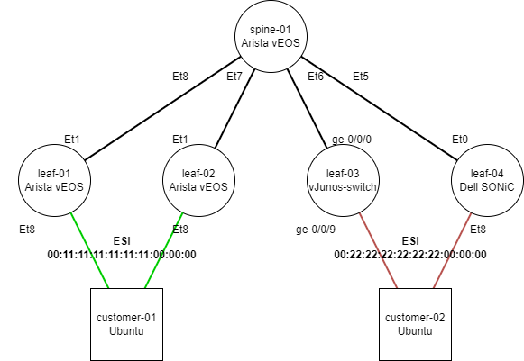

# About

個人的な勉強用。EVPN/VXLAN Multihome 環境をEVENGで試したメモ用リポジトリ。

# Development

環境セットアップ方法を以下に記載します。

## Use Ansible

リストア  

```bash
ansible-playbook project/backup.yml --ask-vault-password
```

# Diagram



# Parameter

Overlay

| | EVPN | VTEP | ASN |
| --- | --- | --- | --- |
| spine-01 | 10.0.0.0 |  | 65000 |
| leaf-01 | 10.0.0.1 | 10.1.0.1 | 65101 |
| leaf-02 | 10.0.0.2 | 10.1.0.2 | 65102 |
| leaf-03 | 10.0.0.3 | 10.0.0.3 | 65103 |

Underlay

|  | Local | Remote |  |
| --- | --- | --- | --- |
| leaf-01 Et1 | 10.2.0.1/31 | 10.2.0.0/31 | spine-01 Et8 |
| leaf-02 Et1 | 10.2.0.3/31 | 10.2.0.2/31 | spine-01 Et7 |
| leaf-03 ge-0/0/0 | 10.2.0.5/31 | 10.2.0.4/31 | spine-01 Et6 |
